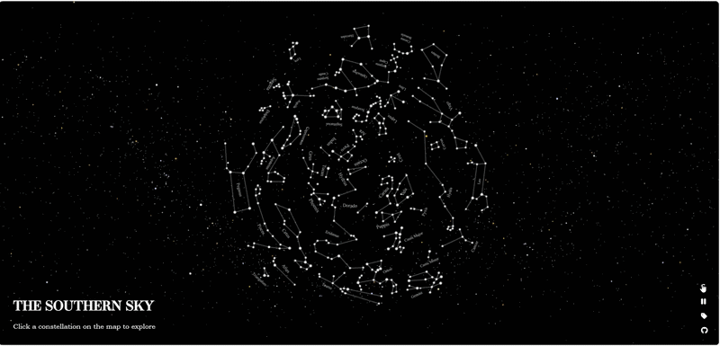

# KonekTala: A Web Guide to the Constellations

🔗 **Live Project:** https://jingqty.github.io/KonekTala/

In line with the Global Astronomy Month, here is a cosmic web map of the constellations prominent in the northern and southern hemisphere of the night sky. 

The map's stereographic projection reflects what you would see standing at the poles and looking straight up. Take a break from geographic maps and watch the stars above!

## Sources

**[HYG Database v4.2](https://www.astronexus.com/projects/hyg)** by David Nash is the primary star data source. The HYG v4.2 database is a compiled catalog from the Hipparcos, Yale Bright Star, and Gliese catalogs. Each star is plotted by its right ascension and declination, sized by magnitude, and colored by its color index from blue-white giants to deep red dwarfs. The data comes as a CSV and was plotted using the web canvas element, with right ascension and declination as coordinates, and magnitude and color index driving each star's size and color.

**[IAU Constellation Reference](https://iauarchive.eso.org/public/themes/constellations/)** was used to identify, position, and name each constellation. Using this as a reference guide for each constellation, all constellations were then retraced in Adobe Illustrator and exported as SVG for full web interactivity.

**Wikipedia OpenSearch API** supplies the constellation descriptions loaded when you click on the map.

---

## Usage

Click any constellation to zoom in and read about it. Click the background to zoom back out. Use the buttons on the right to pause the rotation, toggle labels, or switch between the northern and southern sky.

